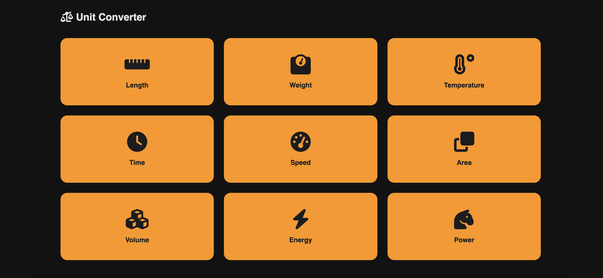
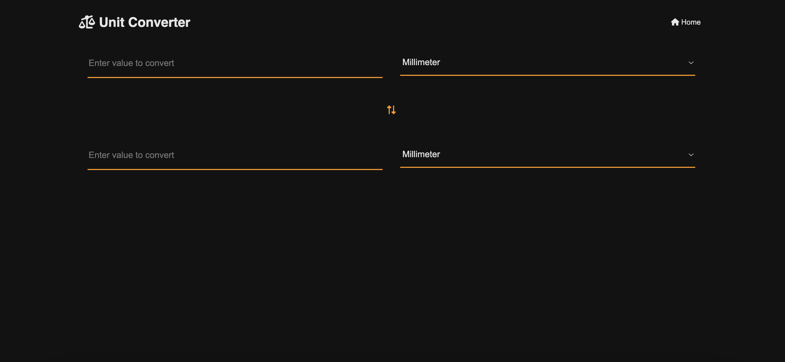

# Unit Converter App

A sleek and minimalistic unit converter app for quick, effortless, and accurate conversions.

## Features

✅ **Minimal & Eye-Catching UI** – A sleek, intuitive design for effortless conversions.  
✅ **Essential & Advanced Conversions** – Convert length, weight, temperature, speed, and more.  
✅ **Fast & Accurate** – Get instant, precise results with a smooth user experience.

## Demo

[Live Demo](https://unit-converter-three-khaki.vercel.app/)

## Screenshots




## Installation

### Clone the repository

```bash
git clone https://github.com/vmanidev/unit-converter.git
cd unit-converter
```

## Tech stack

- HTML
- CSS
- JavaScript

## License

This project is licensed under the MIT License. See the **License** file for more details.
